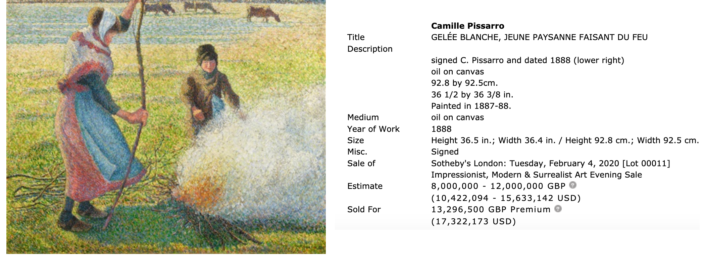
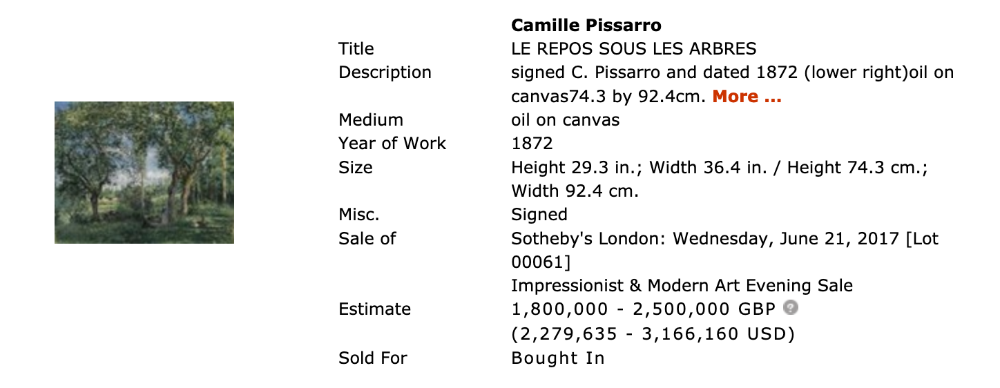
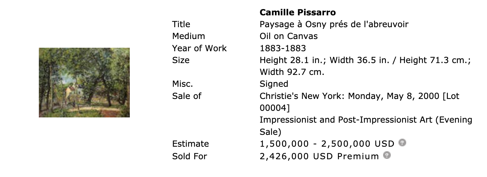
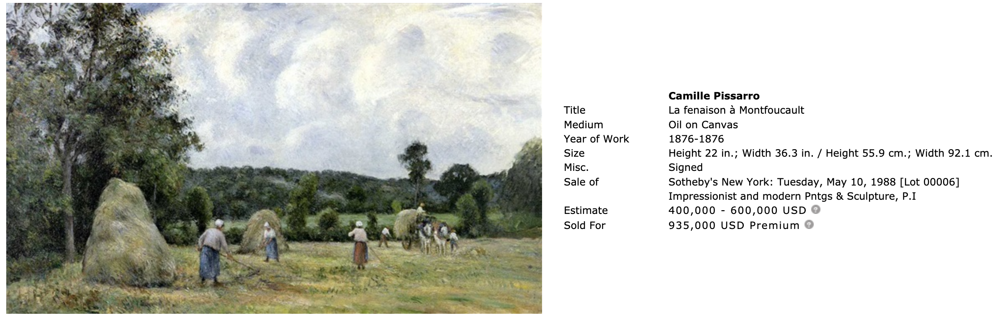

# Valuation

## Question
In light of the information provided in the last lectures, 
how would you value the Pissarro painting below for Fair Market purposes?   

Your value should be one monetary value in US dollar currency.

Write a short summary, giving an explanation of your opinion of value.

## I. Early Life
* bornbirth day
* Dutch Ethnicity

## II. Draw technique & SocialCicle comment
* Impressionism & Neo-impressionism & Pointillism
* friendship with __Monet__ and __Armand Guillaumin__ and __Paul Cézanne__ in __Académie Suisse__ [[1]](#r1)
* Paul Cézanne comment
>“(...) we may all come out of Pissarro. He had the luck to be born in the Antilles, 
>there he learned drawing without a master. He told me all about it. 
>In 1865 he was already cutting out black, bitumen, raw sienna and the ochers. 
>That’s a fact. Never paint with anything but the three primary colors and their derivatives, 
>he used to say to me. Yes, he was the first Impressionist.”
>                    ---------------Paul Cézanne, “Conversations avec Cézanne”

## III. sold record
* you can find it by your own.

## IV. exhibitions
* most record you can find it by your own.
* But remember mention this: even now , Being exhibited in Kunstmuseum Basel,Switzerland.

## V. Rate of 《landscape of Landscape at Louveciennes》
* How the recent coronavirus pandemic change collection taste.
* compare price with other four draws.

* In final ,you offer your valuation.

---------------------

 
 
 

## Reference

- [1] [wiki link](https://en.wikipedia.org/wiki/Camille_Pissarro#:~:text=In%201859%2C%20while%20attending%20the%20free%20school%2C%20the%20Acad%C3%A9mie%20Suisse%2C%20Pissarro%20became%20friends%20with%20a%20number%20of%20younger%20artists%20who%20likewise%20chose%20to%20paint%20in%20the%20more%20realistic%20style.%20Among%20them%20were%20Claude%20Monet%2C%20Armand%20Guillaumin%20and%20Paul%20C%C3%A9zanne.)

