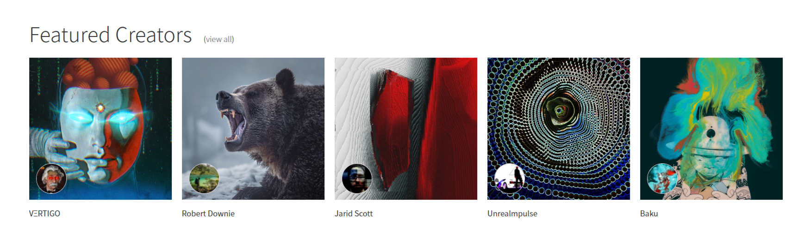
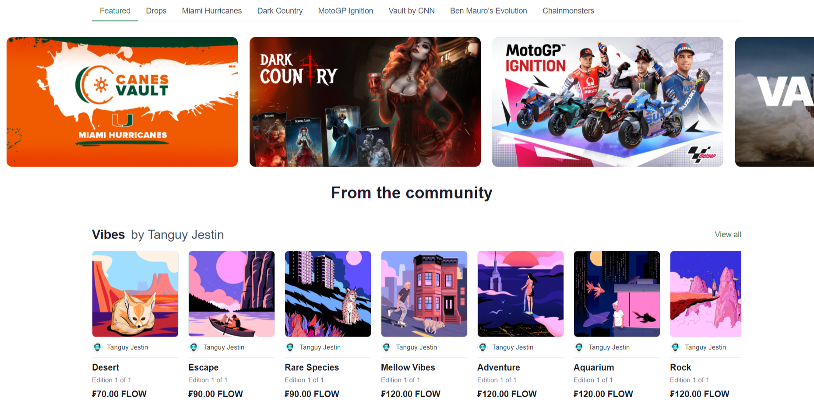

# NFT总览

## 交易平台

###  NFT China

>
>
>
> __技术信息：__   
> __进入门槛：__   

网址:

### OpenSea

> 可以定时发售、买卖、拍卖NFT，没有Drop的概念，看起来人人都可以Drop。             
> 市场支持的的NFT种类比较多样化，有音乐、图片、虚拟现实和游戏卡片。               
> 推荐好友注册，可以从此人将来的交易众分润（像极了拉人头返利）。           
> 还有一个Partner概念，允许用户将NFT分享给别人，当有人通过这个分享链接点进来购买，分享者可以获得40%-50%不等的佣金。           
>__技术信息：__ 基于以太坊网络，`ERC-721`标准，可以使用以太币`ETH`交易，也可以使用信用卡交易，OpenSea甚至支持将你铸造的NFT投放在`Polygon`网络上。           
>__进入门槛：__ 通过钱包开户，就可以成为交易者。          
> 如果公众人物或者公司有着被冒充的风险，我们会在其账户页面上添加蓝色勾勾认证，用以辨别真假，你必须再Twitter或者Instagram上拥有至少10,000个关注者，你的收藏品首先必须在OpenSea上达到100ETH或以上的交易量，并公开所有资产。            

网址:[opensea.io](https://opensea.io/)

### Rarible

> NFT创作、收藏、买卖平台                
> 可以只创作NFT，而不卖出去、也可以将自己的作品隐藏起来          
> 可以把NFT作为礼物赠送给别人            
>可以和OpenSea之间互通             
>当NFT二次出售的时候，创作者可以收取 __版税__              
> __技术信息：__ 使用`ERC-721`标准，基于以太坊网络，使用以太币ETH交易       
> __进入门槛：__  使用`MetaMask`钱包连接上登录，发布艺术品没有门槛，钱包连好就可以上传艺术文件。          
>平台上有个验证徽章，但是看起来即便没有这个验证徽章也不影响使用，如果要做验证的话，需要提供一下几项：       
>* 至少两个社交账户链接，最好是活跃的、有人气的       
>* 如果你是创作者，需要提供铸造NFT的后台工具、如果你是收藏家，提供你的收藏物品历史       
>* 详述你的艺术理念，你为什么来这个平台、你的交易领域是哪些       
>审核过程有时长达两周

网址:[rarible.com](https://rarible.com)

### SuperRare

> “权威的艺术品交易平台”，在此平台上，每个艺术品只能做成一个NFT。如果你的NFT已经放到了其他平台上，那么就不再允许放在这个平台上。       
>每次发布作品时，要保证作品的原创性和合法性，否则将会被踢出平台。       
> __技术信息：__   基于以太坊网络，使用以太币交易       
> __进入门槛：__   邮箱和`MetaMask`登录，平台现在处于试验阶段，每个月只开放很少的艺术家名额（油管上有个外国老哥申请了3个月没有下文），想要成为艺术家，你需要提供以下几项：       
> * 你的完整姓名
> * Instagram和油管链接（应该是要看你的社交内容和粉丝数量）
> * 其他社交平台链接
> * 电子邮箱地址
> * 在手机上录制一段一分钟左右的自我介绍视频（可以是非英语），介绍你的艺术作品和你想分享的东西，然后提供这个视频的链接（最好是油管链接）       
> * 你的优秀艺术品链接
> * 这些作品背后有什么故事》为什么你觉得这些作品应该上传SuperRare？       
> * 你是如何得知SuperRare的？       

看起来走的是精英路线

网址:[superrare.com](https://superrare.com)

### Known Origin

>Known Origin是一个艺术家驱动的NFT艺术市场。让数字创作者可以轻松的验证、展示和销售他们在以太坊区块链上制作的艺术品。       
>市场分为一级市场和二级市场，一级市场用于艺术家发布自己的创作；二级市场用于在收藏者之间交易艺术品。       
>艺术家可以选择定时发售作品。       
>你可以用以太币购买，也可以使用信用卡购买，第一次用卡购买的时候，需要提供身份证明。平台方会帮你做货币兑换。       
> __技术信息：__   基于以太坊网络，使用以太币`ETH`交易。       
> __进入门槛：__   作为交易者，你有一个MetaMask钱包就行，但是要在这个平台上注册成为一个艺术家的话，官方称现在接收到了全世界大量的注册申请，暂时关闭了申请通道，等过一段时间，处理完积压之后会重新开放。这里是[官方推特](https://twitter.com/KnownOrigin_io)，可以追踪他们开通状况。       

网址:[knownorigin.io](https://knownorigin.io/)

### Nifty Gateway

>买卖以及发售NFT，这个网站相当奇葩，它居然使用信用卡支付去买卖作品的。       
> __技术信息：__   官网和FAQ上没有查到任何区块链技术信息，但是看到有合约地址，艺术品的流通应该使用到了区块链技术，但是作为用户，应该没有自己的卡包地址，感觉不安全、没有控制权。       
> __进入门槛：__   成为交易者，邮箱注册，绑定信用卡即可。       
> 想要成为艺术家，官方西药你提供以下信息供审核：       
>*  你的全名
>* 社交平台信息
>* 艺术作品集的网站链接
>* 关于你的远期近期职业规划
>* 擅长的领域
>* 提供一个自我介绍的短片，必须是youtube链接

网址:[niftygateway.com](https://niftygateway.com)

### NBA TopShot

>NBA 主题的NFT发售买卖平台，进球的视频片段居然都做成NFT了，但是这个东西和我们的从事领域不相关，如果将来有需求，再进行信息挖掘。

网址:[nbatopshot.com](https://nbatopshot.com/)

### MakersPlace

>makersPlace是一个由世界上最具创造力的头脑发现和收集真正独特的数字创作的市场。我们为数字创作者提供工具，以保护他们的数字创作并将其出售给他们的粉丝和收藏家。艺术家、摄影师、作家等更多人使用MakersPlace通过区块链技术在线创作和销售他们的作品。     
>通过 MakersPlace 提供的每一个数字创作都是真实且真正独特的数字创作，由创作者签名和发行——通过区块链技术成为可能。即使数字创作被复制，它也不会是真实的原始签名版本。     
>MakersPlace 上的每个数字创作都由创作者进行数字签名，并通过区块链永久记录和验证。     
>每个数字创作都作为独特的数字版本发行。使用区块链技术，创作者可以确保只能拥有有限数量的真实版本，从而确保数字创作的稀缺性和独特性。      
>购买独特的数字创作意味着您对创作拥有完全所有权，然后将其转移并存储在您的数字钱包中以妥善保管。    
>有交易市场，创作者可以Drop作品。      
>可以使用银行卡支付购买    
> __技术信息：__   基于以太坊网络，使用以太币ETH交易     
> __进入门槛：__   邮箱注册     
> 成为创作者需要以下信息审核：      
> * 你的全名
> * 你的邮箱
> * 你的社交媒体链接
> * 你的最好的Work文件链接（GoogleDrive/Dropbox）
> * 提供三个你准备发布到本平台的艺术品链接
> * 你的艺术生涯相关的背景信息（成就、奖项之类的）

网址:[markersplace.com](https://markersplace.com)

### Viv3

>只有艺术家才能发布作品     
>没有交易手续费    
> __技术信息：__ 基于`Flow`的网络链，使用`flow`作为货币进行交易    
> __进入门槛：__   邮件注册开户      
> 想要成为艺术家，提供以下信息备审核：    
> * 你的全名  
> * 邮件地址
> * 你的推特用户名
> * 你创作的艺术属于哪一类？
> 1. 🖼️ Art
>2. 🃏 Collectibles
>3. 🕹️ Game items
>3. 🎵 Music
>5. 其他
> * 请提供3-5个您精品艺术的GoogleDrive链接
> * 你的作品背后有什么故事？为什么你选择Viv3平台？
> * 告诉我们更多关于你的事情？
> * 你有没有在其他平台上发布作品？（我怀你你告诉他们有其他平台，他们不允许你成为艺术家）
> * 你是怎么知道Viv3的？

网址:[viv3.com](https://viv3.com)

## 线上收藏

### CryptoPunks

>CryptoPunks 是 24x24 像素的艺术图像，通过算法生成。大多数都是看起来很笨拙的男孩和女孩，但也有一些比较罕见的类型：猿、僵尸，甚至是奇怪的外星人。            
>CryptoPunks 是 10,000 个唯一生成的字符。没有两个是完全相同的，并且每个都可以由以太坊区块链上的一个人正式拥有。最初，任何拥有以太坊钱包的人都可以免费领取它们，但很快就全部 10,000 个领取了。现在，它们必须通过嵌入在区块链中的市场从某人那里购买。通过这个市场，您可以购买、竞标和出售朋克。下面，您将找到有关市场上每个 Punk 状态的信息。蓝色背景的朋克不出售，目前没有出价。拥有红色背景的朋克可以由其所有者出售。最后，紫色背景的朋克对他们有积极的出价。            
> __技术信息：__   基于以太坊区块链技术，所有权存储在以太坊网络上，支持`ERC-721`网络标准，可以连接MetaMask钱包，使用以太币ETH交易。            
> __进入门槛：__     有自己的MetaMask钱包即可，连接上，就自动在他们网站上开户了。            

网址:[larvalabs_cryptopunks](https://www.larvalabs.com/cryptopunks)

### Meebits

>和上一个是一家的，都是Larvalabs团队，但这个是3D版的，甚至还有[建模动画](https://meebits.larvalabs.com/public/images/homepage/dancer2.mp4)
>
>此平台不收取交易费用
> __技术信息：__   
> __进入门槛：__   

网址:[larvalabs_meebits](https://meebits.larvalabs.com/)

### HashMasks

>类似于加密猫。根据算法随机生成戴着面具的图片，全平台能够生成的种类有一个上限，这确保了NFT的稀缺性。
> __技术信息：__   基于以太坊网络，使用ETH交易
> __进入门槛：__   MetaMask钱包开户

网址:[thehashmasks.com](https://www.thehashmasks.com/)

## 游戏类

### Axie Infinity

>类似于加密猫，随机生成属于自己的小怪物，可以战斗赢得Token，然后用这个token去购买别人的小怪物，或出售自己的小怪物赚取Token

> __技术信息：__    基于以太坊网络，`AxsToken`可以用以太币`ETH`互相兑换。
> __进入门槛：__     需要一个`Ronin`钱包连接开账户

网址:[axieinfinity.com](https://axieinfinity.com/)

### 

>
>
>
> __技术信息：__   
> __进入门槛：__   

网址:

